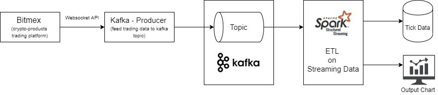

# Spark-Learning (DRAFT)

### Note: These codes were tested on following environment
- Apache Kafka v2.5.0
- Apache Spark 2.4.5
- python 3.7
- scala 2.11.12 

## Objective and Overview Architecture

*Overview Architecture*

This repository was created to demonstrate features of Apache Spark - Structured Streaming API. 